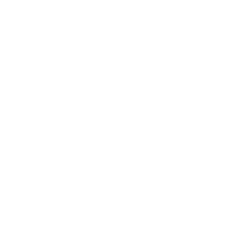

# installer

    

el installer de cordlang es un installer de codigo abierto hecho con electronjs, vite, y hecho con ts y componentes en js

una manera facil de instalar cordlang en tu equipo sin importar el sistema operativo que tengas

